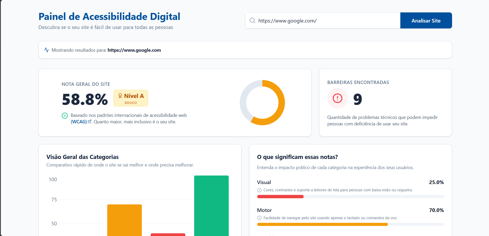

# ♿ Plataforma de Acessibilidade Digital PcD

> [!TIP]
> **Acesse a plataforma ao vivo:** <a href="https://acessibilidade-digital-pcd.vercel.app" target="_blank">👉 Clique aqui para testar</a>

Uma plataforma **full-stack** desenvolvida para analisar, pontuar e fornecer recomendações práticas sobre a acessibilidade de websites.  
O projeto automatiza a varredura de código HTML para identificar barreiras técnicas que dificultam ou impedem a navegação de pessoas com deficiências **visuais, motoras, cognitivas e auditivas**, com base nas diretrizes internacionais **WCAG**.

---

## 🎯 Sobre o Projeto

Garantir que a web seja inclusiva é uma necessidade fundamental.  
Esta ferramenta atua como uma **consultoria automatizada**: o usuário insere a URL de um site e a plataforma realiza:



- Renderização completa da página  
- Extração do DOM  
- Aplicação de heurísticas de acessibilidade  

Ao final, o sistema gera:

- **Nota Geral e Específica**  
  Pontuações detalhadas por tipo de deficiência (Visual, Motora, Cognitiva e Auditiva)

- **Mapeamento de Barreiras**  
  Identificação exata de onde os erros ocorrem no código-fonte

- **Plano de Ação**  
  Recomendações acionáveis agrupadas por prioridade  
  (Crítico, Sério, Moderado, Menor)

---

## 🏗️ Arquitetura e Tecnologias

O repositório segue o modelo **cliente-servidor**, separando claramente interface e processamento lógico.

---

## 🖥️ Frontend (`/frontend`)

Interface interativa e responsiva, focada na visualização clara de dados e métricas.

**Tecnologias:**

- Framework: **React + TypeScript**
- Estilização: **Tailwind CSS**
- Visualização de Dados: **Recharts**
- Ícones: **Lucide React**

📖 Para mais detalhes sobre a interface, comandos de build e estrutura de componentes, consulte o README do Frontend.

---

## ⚙️ Backend (`/backend`)

API RESTful de alta performance responsável pelo scraping e motor de análise.

**Tecnologias:**

- Framework: **FastAPI**
- Scraping & Parser:
  - **Playwright (assíncrono)** para páginas dinâmicas (SPA/SSR)
  - **BeautifulSoup4** para análise do HTML
- Banco de Dados: **SQLite** com **SQLModel (ORM)**
- Integração: **CORS** configurado para comunicação com o frontend

📖 Para mais detalhes sobre rotas, regras do analisador e banco de dados, consulte o README do Backend.

---

## 🚀 Principais Regras Verificadas

O motor de análise heurística (`analyzer.py`) cobre falhas comuns de acessibilidade, incluindo:

- Ausência de texto alternativo (`alt`) em imagens  
- Campos de formulário sem `label` associado  
- Quebra na hierarquia de cabeçalhos (`<h1>` a `<h6>`)  
- Ausência do atributo `lang` na tag `<html>`  
- Links sem propósito discernível  
- Uso incorreto do atributo `tabindex` (valores maiores que zero)  
- Uso de tags obsoletas e prejudiciais (`<marquee>`, `<blink>`)

---

## 🛠️ Como Executar o Projeto Localmente

Para rodar o ecossistema completo, você precisará iniciar os dois serviços paralelamente.

### 1. Iniciando o Backend
Abra um terminal, navegue até a pasta do backend e inicie o servidor FastAPI (geralmente executado na porta `8000`):
```bash
cd backend
# Instale as dependências
pip install -r requirements.txt
# Instale os navegadores do Playwright
playwright install chromium
# Inicie o servidor
uvicorn main:app --reload
```

### 2. Iniciando o Frontend
Em um novo terminal, navegue até a pasta do frontend e inicie o servidor de desenvolvimento (geralmente executado na porta `5173`):

```bash
cd frontend
# Instale as dependências
npm install
# Inicie o projeto
npm run dev
```
Acesse `http://localhost:5173` no seu navegador para utilizar a plataforma.

## 📂 Estrutura de Diretórios Resumida

```text
/
├── backend/                # API em FastAPI, Banco de Dados e Motor de Análise
│   ├── app/
│   │   ├── api/            # Rotas da aplicação (analyses, recommendations)
│   │   ├── core/           # Lógica de negócio (analyzer.py, scoring.py)
│   │   ├── db/             # Modelos e conexão com SQLite
│   │   └── utils/          # Scripts auxiliares (scraper com Playwright)
│   ├── main.py             # Ponto de entrada da API
│   └── README.md           # Documentação específica da API
│
├── frontend/               # Aplicação React/Vite
│   ├── src/
│   │   ├── components/     # Componentes da interface (Dashboard, Charts, etc.)
│   │   ├── hooks/          # Hooks customizados (useAnalyze, useRecommendations)
│   │   └── types/          # Definições de tipagem TypeScript
│   └── README.md           # Documentação específica da interface
│
└── README.md               # Este arquivo (Visão geral do projeto)
